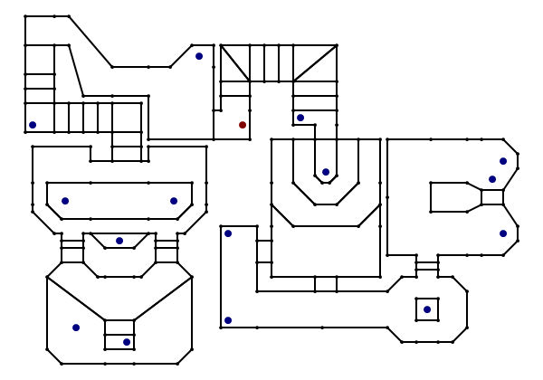

# Nostromo

This is an experimental 3D engine for the TI-83 and TI-83+ graphical calculators.

As it is an experiment it is not desperately useful, and it is likely to contain bugs that may crash your calculator. **Please back up any important files before running this program.**

Two binaries are provided; _Nostromo.8xp_ (for the TI-83+) and _Nostromo.83p_ (for the TI-83). The TI-83 binary requires an Ion-compatible shell. The TI-83+ binary requires a MirageOS-compatible shell.

Source code is now provisionally provided with the warning that it is currently too messy and buggy to be of much use.

## Usage ##

Select the program from the list in your shell of choice and run it. The following keys can be used to control the demo:

* General
	* `Clear` Exit.
* Movement
	* `↑` / `↓` Move forwards/backwards.
	* `Trace` / Graph Strafe left/right.
	* `Mode` / `X,T,Θ,n` Move up/down ("fly mode" only).
* Looking
	* `←` / `→` Look left/right.
	* `Del` / `Stat` Look up/down.
* Interaction
	* `Alpha` Open/close doors.
* Options
	* `Y=` Show/hide the options menu.

## Options menu

Press `Y=` to show or hide the options menu. Select an option from the menu with the `↑` and `↓` keys.

Pressing `Enter` or `2nd` will change the highlighted option.

* **Show FPS counter** — When enabled, this displays the number of frames rendered each second in the bottom left of the screen.
* **CPU speed** — Toggle between 6MHz and 15MHz on supported calculators (the regular TI-83+ and TI-83 are limited to 6MHz operation only).
* **Fly mode** — Enabling this mode allows you to freely move the camera up and down rather than walking around on the floor.
* **Collision detection** — Disabling this allows you to walk through walls.
* **Render objects** — When disabled, sprite objects are not drawn.
* **View statistics** — Shows the camera position, angle, how many BSP nodes were visited, how many sub-sectors were drawn and how many attempted/successful walls were drawn.

## Known issues

* Performance is not especially good at the moment. Looking across the large room with the pit in the middle slows the framerate to a crawl owing to the sheer number of subsectors and lines being handled.
* Some pixels are not rendered when they should be. This is especially noticeable near the ends of steeply sloping wall edges.
* When you are very close to the edge of a wall it may get projected incorrectly (integer overflow) and you will see either a vertical line flash into view then out again or a region of the screen will appear blank.
* In "fly mode" you can fly above the ceiling and below the floor.
* If the camera is moved into a "solid" region it will be instantly pushed out into free space when near a wall. This can be triggered in normal usage (without disabling collision detection or enabling fly mode) by standing under an open door then closing it; you'll be forced into the room when the bottom edge of the door moves below your head height.
* Collision detection is not properly handled around the very ends of walls, which may cause a sudden jump in player position when you "slide" around a corner.
* The current floor height is calculated based on the point directly under the centre of the player and not taking the player's radius into consideration. This can cause an unnatural jump when you slowly walk off the edge of a raised portion of the level.
* If the frame rate drops low enough it is possible to walk through walls. This is down to the way movement is scaled by frame time; the longer a frame takes to render, the further you move during that frame. If the frame rate drops low enough you move fast enough to outwit the collision detection routines.
* Moving sectors are not reset when you restart the level. As an example, lower the platform in the middle of the map then exit and restart the program. When you walk to it you will notice that it is still lowered.

If you would like to report an issue, please include the camera position and viewing angle in your report (accessible from the "View statistics" menu option).

## Map

The demo world is based on parts of E2M7 (Spawning Vats) from _DOOM_. I chose this level as it has some interesting architecture without being too demanding as well as for historical reasons; as far as I am aware it was one of the first levels created for DOOM that appeared in the final game.

The lines indicate walls. Each wall connects two vertices, indicated by the smaller black blobs. Some walls are split into multiple segments; this is either a by-product of the need to break the level into convex sub-sectors for rendering purposes or to avoid a limitation with the clipping routines (long walls viewed at a steep angle can be clipped incorrectly).

The larger blue blobs indicate "things" — objects represented by a sprite in the world. The single large red blob indicates the player's starting position. 
